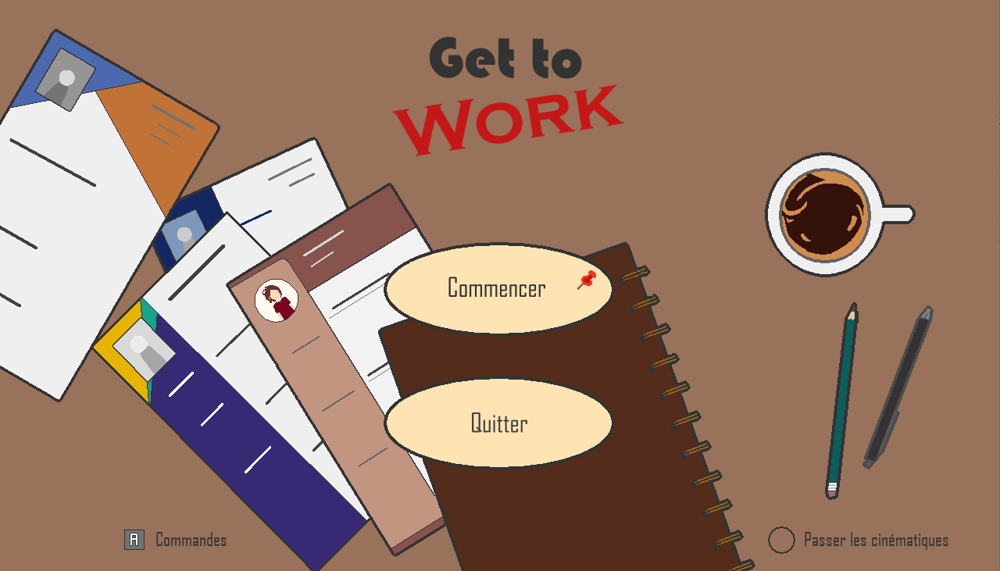
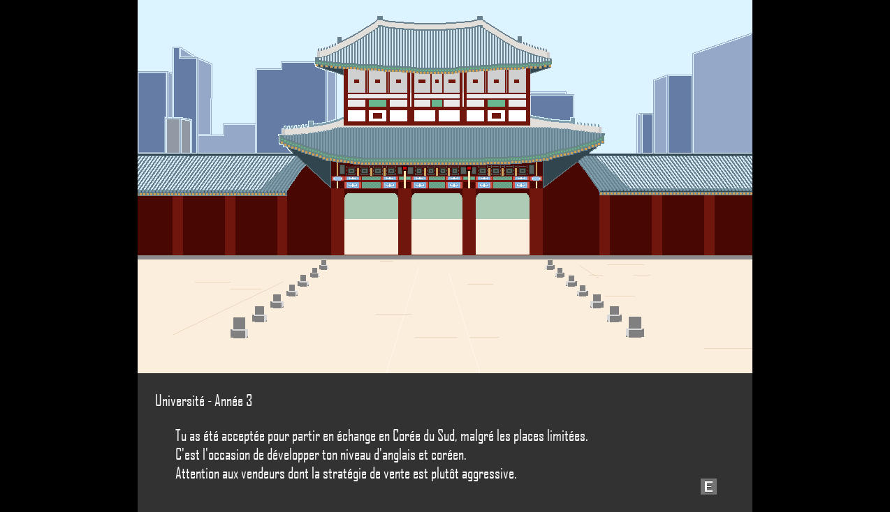
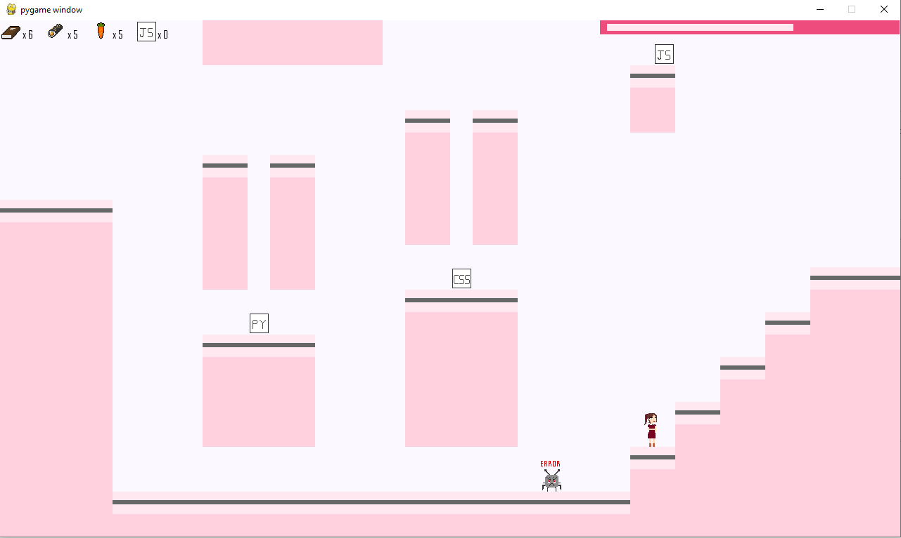
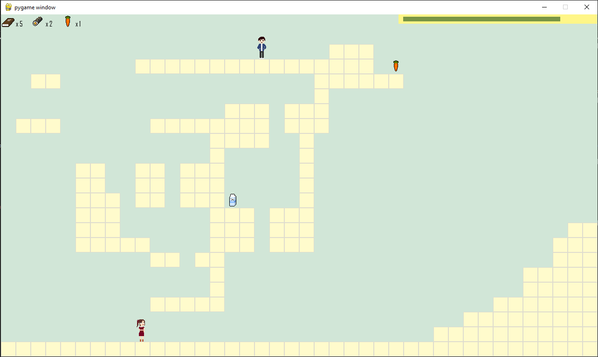

# GET TO WORK

## Présentation

**GET TO WORK** est un jeu de plateforme 2D développé à l'aide de Python 3.13 et la bibliothèque Pygame.

Le joueur doit collecter un maximum d'items avant la fin du temps imparti pour augmenter ses compétences et ses chances de réussir l'entretien d'embauche à la fin de la partie. 

## Fonctionnalités
- Déplacements sur une carte 2D 
- Système de gravité et sauts
- Collisions
- Animation du joueur
- Transition caméra entre salles 
- Système de chronomètre
- Système de construction et chargement de niveaux
- Rencontres ennemies et QTE
- Collecte d'items et compétences
- Calcul de score
- Victoire / Défaite

## Commandes

|       Touche      |        Action         |
| ----------------- |  -------------------- |
| Flèche droite / D |  Déplacement à droite |
| Flèche gauche / G |  Déplacement à gauche |   
|         E         |        Valider        |
|       Espace      |        Sauter         |
|Flèche haut/Z(Menu)|  Déplacement en haut  |
|Flèche bas/S(Menu) |  Déplacement en bas   |
|      A (Menu)     |Afficher les commandes |

## Assets

L'ensemble des assets graphiques et audio du projet (musiques, effets sonores, images, animations), ont été réalisés spécialement pour le jeu par l'auteur.

## Techonologie et outils
- Pygame
- Python 3.13
- FL Studio
- Krita

## Lancement

Exécuter le fichier principal main.py

#### Prérequis et installation : 
- Python 3.13
- Pygame

## Test

Un plan de test **Test_Plan.md** a été réalisé pour couvrir et valider les fonctionnalités principales du jeu.

## Captures d'écran
 
### Menu

### Cinématique

### Gameplay

## Auteur

Note : Ce jeu représentant mes compétences et mon parcours, le véritable moyen de gagner le jeu est encore de m'embaucher.

Développé par Anaïs KEDZIA  
anais.kedzia@gmail.com  
[LinkedIn](https://www.linkedin.com/in/anais-kedzia/  )  
[GitHub](https://github.com/AnaisKedzia )   

